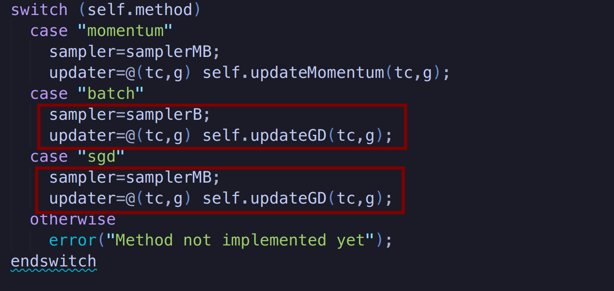

# Tarea 3: Regresión logística

Este código base presenta un optimizador incompleto, que permite
explorar los conceptos de descenso de gradiente. Un regresor lineal
sirve de base para entender cómo utilizar all optimizador, y con esa
información debe implementarse un regresor logístico básico para
clasificar el sexo de pingüinos basado en algunas características
fenotípicas como longitud y profundidad del pico, longitud de las
aletas, peso, etc.

## Dependencias

Este código utiliza los paquetes statistics y automatic-differentiation.
Desde la terminal de GNU/Octave los instala con:

     pkg install -forge statistics
     pkg install "https://github.com/StevenWaldrip/Automatic-Differentiation/archive/refs/tags/1.0.0.tar.gz"

## Ejecución de la solución

- Ubiquese en la carpeta `root` del repositorio.

### Regresión lineal

- Ejecute el siguiente código en la terminal de GNU/Octave:

```octave
    octave regression_linear.m
```

- Corresponde a la solución de la parte 1 de la tarea.

### Regresión logística

- Ejecute el siguiente código en la terminal de GNU/Octave:

```octave
    octave regression_logistic.m
```

- Corresponde a la solución de la parte 2,3,4,5,6,7,8,9,10,11,12 de la tarea.

Nota: Al principio del código se encuentran flags para ejecutar partes
especificas de la tarea por defecto se ejecutan todas las partes. Si
desea ejecutar solo una parte, ponga la flag en `false`.

| Flag                | Descripción                                                                             |
| ------------------- | --------------------------------------------------------------------------------------- |
| `part_four`         | Corresponde a la solución 2,3,4,5,6 de la tarea.                                        |
| `part_seven`        | Corresponde a la solución 7,8,9 de la tarea.                                            |
| `part_extra_points` | Corresponde a la solución 12 de la tarea. Se debe tener la flag `part_seven` en `true`. |
| `part_ten`          | Corresponde a la solución 10 y 11 de la tarea.                                          |

## Documentación de la Solución

También se generó un `solution.pdf` de este mismo readme. Se ubica en la
carpeta `docs` junto con todas las gráficas de la tarea.

### Parte 1

- Se agrega el update del descenso de gradiente en `optimizer`.


- Se agrega el método de `"batch"` y `"sgd"` en `optimizer`.



- Se gráfica el error de la perdida de la regresión lineal, para los
  métodos `"batch"`, `"sgd"` y `"momentum"`.


### Parte 2 y 3

- Se agrega la hipotesi de regresión logística.


- Se agrega la perdida de la regresión logística.


### Parte 4, 5, 6

- Se optimiza la regresión logística con los metodos de `"batch"`,
  `"sgd"` y `"momentum"`. Y se gráfica el error de la perdida.


- Se calcula el error emprico de la regresión logística.


- Se obtiene el resultado del error emprico de la regresión logística,
  para cada de los métodos de optimización.


- Se observa que el de menor error empírico fue el `"sgd"` y el `"batch"`.

¿Cuáles son las features más importantes para la regresión logística?

Si ordenamos de mayor magnitud a menor el valor de la componente de
$\theta$ en el caso del método `"sgd"`, observamos que:

| Componente de $\theta$           | Magnitud |
| -------------------------------- | -------- |
| $\theta_3$ "Culmen Depth (mm)"   | 1.238336 |
| $\theta_5$ "Body Mass (g)"       | 1.021229 |
| $\theta_2$ "Culmen Length (mm)"  | 0.451153 |
| $\theta_1$ "Bias"                | 0.116149 |
| $\theta_4$ "Flipper Length (mm)" | 0.072030 |

Entonces vemos que las features más relevantes para la regresión
logística para determinar el sexo son la profundidad del pico, el peso
y la longitud del pico.

Porque estas en teoría son las features más relevantes para la
regresión logística. Esto es porque entre mayor sea la magnitud de
del theta esta feature tiene mayor peso en el calculo de la hipótesis
de regresión logística.

### Parte 7, 8, 9

- Para encontrar de forma empírica la features más relevantes para
  la regresión logística para conocer el sexo de los pingüinos, se
  calcula el error empírico para dos pares de features. Utilizamos
  el método `"sgd"` para la regresión logística, para la minización
  del error.


- Obtuvo que $\theta_3$ "Culmen Depth (mm)" y $\theta_5$ "Body
  Mass (g)" son las features más relevantes. Esto concuerda con el
  análisis del punto 4.

- Se dibuja la superficie generada por la regresión logística de las
  features "Culmen Depth (mm)" y "Body Mass (g)".


- Se gráfica la fontera de decisión de las features "Culmen Depth
  (mm)" y "Body Mass (g)".


### Parte 10 y 11

- Se vuelve al calcular el error empírico de la regresión logística
  pero para 3 features.


- Se obtiene que las 3 features más relevantes para la regresión
  logística son $\theta_3$ "Culmen Depth (mm)", $\theta_5$ "Body
  Mass (g)" y $\theta_1$ "Bias". Utilizamos el método `"sgd"` para
  la regresión logística, para la minización del error.

- Se desconoce el porque dio un menor error, con "Bias" en vez que con
  "Culmen Length (mm)".

- Se gráfica el perdida de la regresión logística vs la componentes
  del $\theta$.


### Parte 12 (Extra Points)

- Se usa el resultado de la parte 6, para el uso de las features más
  relevantes para la regresión logística.

- Se dibuja la superficie generada por la regresión logística de las
  features "Culmen Depth (mm)" y "Body Mass (g)". Pero con orden 12 de
  la matriz de diseño.


- Se gráfica la fontera de decisión de las features "Culmen Depth
  (mm)" y "Body Mass (g)". Pero con orden 12 de la matriz de diseño.


## Integrantes

- Carlos Andrés Mata Calderón - 2019033834
